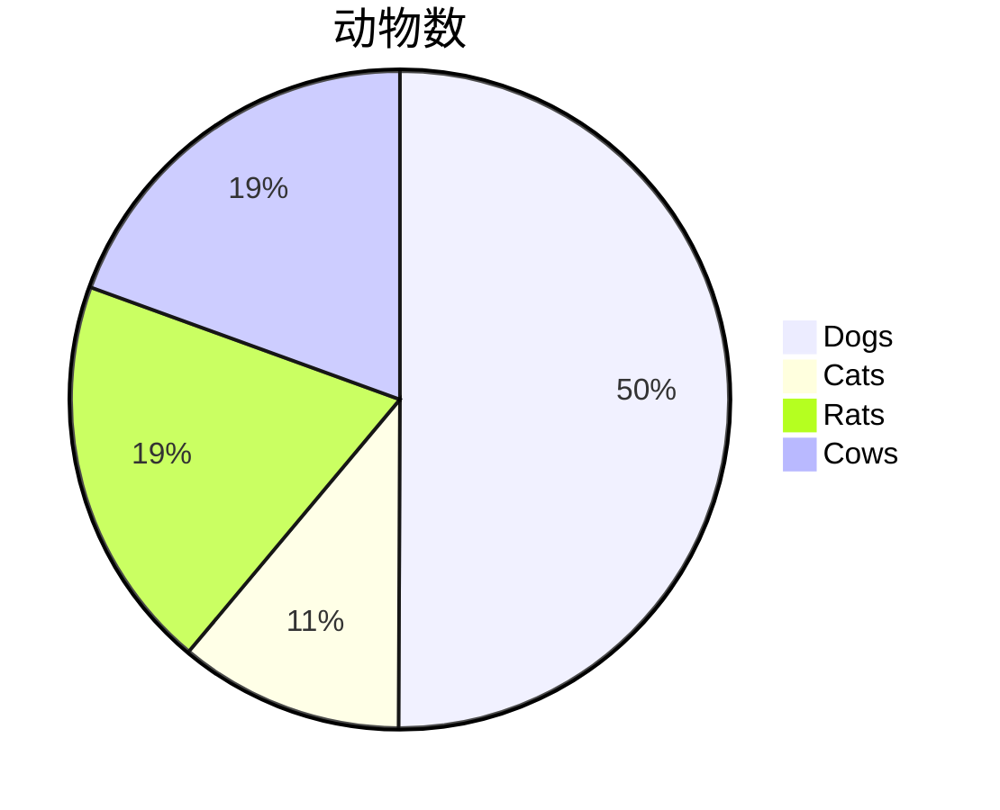

之前在markdown文件中加入图片内容，我一般都是用其他画图软件画好之后，通过markdown插入图片的语法插入的。 

```

```

## 01 — 饼图
画饼图非常非常简单，可以在Typpra中直接写，注意脚本语言标记为mermaid： 



## 02 — 时序图

Typora对时序图的支持也是比较完美的，可以在Typpra中直接写，注意脚本语言标记为mermaid： 

```
sequenceDiagram
    title: 时序图例子
    Alice->>Alice: 自言自语
    Alice->>John: Hello John, how are you?
    %% over 可用于单独一个角色上，也可以用于相邻两个角色间：
    Note over Alice,John: A typical interaction
    %% loop 后跟循环体说明文字
    loop Healthcheck
        John->>John: Fight against hypochondria
    end
    Note right of John: Rational thoughts!
    John-->>Alice: Great!
​
    John->>Bob: How about you?
    %% 控制焦点：用来表示时序图中对象执行某个操作的一段时间
    %% activate 角色名 表示激活控制焦点
    activate Bob 
    Bob-->>John: Jolly good!
    %% deactivate 角色名 表示控制焦点结束
    deactivate Bob
​
    Alice->>+Bob: Hello John, how are you?
​
    rect rgb(175, 255, 212)
    alt is sick
    Bob-->>Alice: Not so good :(
    else is well
    Bob-->>Alice: Feeling fresh like a daisy
    end
    opt Extra response
    Bob-->>Alice: Thanks for asking
    end
    end
    loop communicating
        Alice->>+John: asking some questions
        John-->>-Alice: answer 
    end
    par Alice to John
      Alice->>John: Bye
    and Alice to Bob
      Alice->>Bob: Bye
    end
    Alice-xJohn: 这是一个异步调用
    Alice--xBob: 这是一个异步调用
```

## 03 — 流程图

Typora对流程图的支持也是比较完美的，可以在Typpra中直接写，注意脚本语言标记为mermaid： 

```
graph LR
%% 这是注释，流程图中用到的各种图形画法、连线
  id1((start))-->A[方角矩形]
    A -.虚线.-> B(圆角矩形)
    A --> F[\平行四边形\]--> G[/平行四边形/]-->H[/梯形\]-->I[\梯形/]
    A ---|没箭头的连线|i21(圆角矩形)
    B --文案--> C{菱形}
    C -->|One| D{{Result one}}
    C -->|Two| E>Result two]
```

```
graph TB
%% 子流程
    c1-->a2
    subgraph one
    a1-->a2
    end
    subgraph two
    b1-->b2
    end
    subgraph three
    c1-->c2
    end
```

```
graph TB
%% 快手发布视频流程
  B(点击拍摄) --> C{是否允许快手拍摄视频}
  C-->|N|D[提示用户允许抖音拍摄]
  C-->|Y|E[开始拍摄]
  E-->F[相册]-->G[自行编辑]-->H[发布]
  E-->I[选择滤镜和音乐]-->J[按住拍摄]-->H
  E-->J
  H-->|N|K[返回首页]
  H-->|Y|L[所有人可见]
```

## 04 — UML类图
先看类的画法，-开头的是它的私有属性，+开头的是类的公共方法。Protected方法则在前面放上#。对于方法的表示，括号中可以放入方法的参数，在括号后面可以放上方法的返回值类型。类似这样： 

```
classDiagram
class Duck{
          -String beakColor
          - double weight
          +swim()
          +quack()
          #count()
          +getPrice(count) double
          +someAbstractMethod() *
          -someStaticMethod() $
      }
class Shape{
%% This whole line is a comment classDiagram class Shape <<interface>>
    <<interface>>
    noOfVertices
    draw()
}
class Color{
    <<enumeration>>
    RED
    BLUE
    GREEN
    WHITE
    BLACK
}
class Relation{
    <<<<abstract>>>>
}
```

这段代码需要在mermaid在线编辑器 `https://mermaid-js.github.io/mermaid-live-editor`编辑，才能出现下面的效果，Typora编辑器目前对上面的语法支持的不是很好。 
效果如下：  

Typora是在 0.9.9.30 (0.9.80) beta版本开始支持classDiagram的，目前支持的还不太好。  
所以画classDiagram时，最好使用mermaid在线编辑器 `https://mermaid-js.github.io/mermaid-live-editor`编辑，然后保存成svg图片，再将其插入到markdown中。  


类与类之间的关系，常见有下面6种： 

1. 依赖（Dependency）：元素A的变化会影响元素B，但反之不成立，那么B和A的关系是依赖关系，B依赖A；uml中用带箭头的虚线表示，箭头指向被依赖元素。
2. 泛化（Generalization）：就是通常所说的继承（特殊个体 is kind of 一般个体）关系。uml中用带空心箭头的实线线表示，箭头指向一般个体。
3. 实现（Realization）：元素A定义一个约定，元素B实现这个约定，则B和A的关系是Realization，B 实现了 A。这个关系最常用于接口。uml中用空心箭头和虚线表示，箭头指向定义约定的元素。
4. 关联（Association）：元素间的结构化关系，是一种弱关系，被关联的元素间通常可以被独立的考虑。uml中用实线表示，箭头指向被依赖元素。
5. 聚合（Aggregation）：关联关系的一种特例，表示部分和整体（整体 has a 部分）的关系。uml中用带空心菱形头的实线表示，菱形头指向整体。
6. 组合（Composition）：组合是聚合关系的变种，表示元素间更强的组合关系。如果是组合关系，如果整体被破坏则个体一定会被破坏。uml中用带实心菱形头的实线表示，菱形头指向整体。

看下类与类之间关系的画法，使用mermaid在线编辑器，写下下面的代码，主要是箭头和线条类型不同： 

```
classDiagram
classK ..> classL : 依赖关系
classA --|> classB : 继承关系（泛化）
classM ..|> classN : 实现关系
classG --> classH : 关联关系
classE --o classF : 聚合关系
classC --* classD : 组合关系
```

多重性是用来说明两个类之间的数量关系，表示为一个整数范围n…m，整数n定义所链接的最少对象的数目，m为最多对象数目（但不确定最大数时，可以*号表示）。 

```
classDiagram
    Customer "1" --> "*" Ticket
    Student "1" --> "1..*" Course
    Galaxy --> "many" Star : Contains
    Sky "1"--> "1" Sun
    Parent "1" -- "0..2" Children
    Person "1" -- "2" Eyes
```

## 05 — 状态转移图
状态转换图主要用来描述系统的状态，及引起系统状态转化的事件，来表示系统的行为。状态转化图可以用来描述单程生命周期，也可以用来表示循环运行过程。 

单程生命周期起点是实心圆，终点是同心圆，内圆为实心。初态只有一个，终态可以有很多。循环运行过程一般不考虑起点与终点。 

举个例子感受一下，可以在Typpra中直接写，脚本语言标记为mermaid： 

```
stateDiagram
  %% 单程生命周期起点是实心圆，终点是同心圆，内圆为实心。
  %%这个例子包含是3个状态Still, Moving 和 Crash. 从Still状态可以转移到Moving，从Moving可以转移到Still 或者 Crash。不能从Still转移到Crash
    [*] --> Still 
    Still --> [*]
    Still --> Moving: A transition
    note right of Moving
            Moving可以转移到Still或者Crash
    end note
    Moving --> Still 
    Moving --> Crash
    Crash --> [*]
```

来看下多个互不干扰状态的并行状态流转： 

```
stateDiagram
        [*] --> Active
    note right of Active
            起始状态进入Active状态后
            就可以并行执行三个状态的流转了
      end note
        state Active {
            [*] --> NumLockOff
            NumLockOff --> NumLockOn : EvNumLockPressed
            NumLockOn --> NumLockOff : EvNumLockPressed
            --  
            [*] --> CapsLockOff
            CapsLockOff --> CapsLockOn : EvCapsLockPressed
            CapsLockOn --> CapsLockOff : EvCapsLockPressed
            --
            [*] --> ScrollLockOff
            ScrollLockOff --> ScrollLockOn : EvCapsLockPressed
            ScrollLockOn --> ScrollLockOff : EvCapsLockPressed
        }
```
分支状态流转代码： 

```
stateDiagram
 %% state fork_state <<fork>>声明一个state
    state fork_state <<fork>>
      [*] --> fork_state
      fork_state --> State2
      fork_state --> State3
​
      state join_state <<join>>
      State2 --> join_state
      State3 --> join_state
      join_state --> State4
      State4 --> [*]
```

## 06 — 总结

上面介绍了在Typora中画饼图、时序图、流程图、类图和状态转移图5种图形的画法。除了类图目前Typora支持不太好之外，其他4种图形的支持都非常棒。所以建议大家除了类图到在线编辑器上制作之外，其他的图都在Typora中制作。 

另外，Typora还可以画甘特图，可以参考官方网站`https://mermaid-js.github.io/mermaid/#/gantt`。 
Typora对数学公式的编写也非常友好，大家可以探索。 
现在我越来越喜欢Markdown语法了，Typora也成为了我的主要编辑器，通过这一个编辑器，即可写文章，又可以画常见的图形，还可以编辑数学公式。 
重要的是Typora体积小，还免费，支持Linux、Windows和macOS三个平台，没有换平台就要换编辑器的麻烦。 

赶紧拥抱Typora吧。 

## 参考资料：

https://mermaid-js.github.io/mermaid/

https://www.typora.io/

https://blog.csdn.net/liuchunming033/article/details/106034799/


